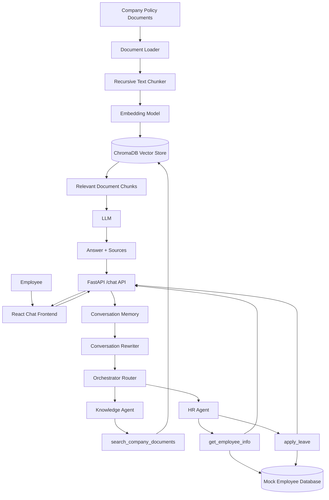

# EmployeeMate - RAG + Agentic Employee Assistant

EmployeeMate is a full-stack AI assistant for employee policy questions and basic HR actions. It combines a Retrieval-Augmented Generation pipeline with an agentic workflow that can choose between company document search, employee profile lookup, and leave application tools.

---

## Bonus Features Reference Guide

The codebase includes all 10 bonus features and security enhancements:

| # | Feature | Location in Code | How to Test |
|---|---|---|---|
| **1** | **Streaming Responses** | `app/rag.py` (`RAGPipeline.stream_query`), `app/main.py` (`chat_stream`), `frontend/src/services/api.js` (`sendChatMessageStream`) | `POST /chat/stream` with curl or submit query in UI to watch real-time token streaming. |
| **2** | **Conversation Memory** | `app/memory.py` (`ConversationMemory`), `app/conversation.py` (`rewrite_followup`) | `pytest tests/test_backend.py -k test_memory_isolation` |
| **3** | **Metadata Filtering** | `app/rag.py` (`derive_category_from_filename`), `app/agents/knowledge_agent.py` (`_infer_category`) | `pytest tests/test_backend.py -k test_category_derivation` |
| **4** | **Reranking** | `app/rag.py` (`TwoStageReranker.rerank_with_scores`) | `pytest tests/test_backend.py -k test_offline_answer_synthesis` |
| **5** | **Retrieval Confidence Threshold** | `app/rag.py` (`search_company_documents` cutoff `MIN_RERANK_SCORE`), `app/config.py` | `pytest tests/test_backend.py -k test_confidence_threshold_rejection` |
| **6** | **Docker Setup** | `Dockerfile`, `docker-compose.yml`, `.dockerignore` | `docker-compose up --build` |
| **7** | **Unit Tests** | `tests/conftest.py`, `tests/test_backend.py` | `python -m pytest tests/test_backend.py -q` |
| **8** | **Logging & Observability** | `app/logging_config.py` (`setup_logging`), `app/main.py` (`logging_request_id_middleware`), `/metrics` | `curl http://localhost:8000/metrics` or check server JSON stdout logs. |
| **9** | **Prompt Injection Protection** | `app/security.py` (`detect_prompt_injection`, `sanitize_history`, `wrap_context`, `verify_canary`), `app/agents/orchestrator.py` | `pytest tests/test_backend.py -k test_prompt_injection_detection` |
| **10** | **Basic Authorization (RBAC & JWT)** | `app/auth.py` (`Principal`, `get_current_user`, `require_hr`, `enforce_prompt_scope`), `app/main.py` (`/auth/login`, `/employees`) | `pytest tests/test_backend.py -k test_auth_matrix` |

---

## Tech Stack

- Frontend: React, Vite, Tailwind CSS
- Backend: Python, FastAPI
- RAG framework: LangChain
- Vector database: ChromaDB
- Embeddings: Hugging Face `all-MiniLM-L6-v2`
- LLM Provider: Configurable switch supporting Google Gemini (`gemini-2.5-flash`) & OpenAI (`gpt-4o-mini`), with offline synthesis fallback
- Reranking: Sentence Transformers CrossEncoder
- Testing: Python `unittest`, pytest, FastAPI TestClient

## Prerequisites

- Python 3.11 or newer
- Node.js 18 or newer
- npm
- Optional: Gemini, OpenAI, Ollama, or LM Studio access

## Project Architecture

EmployeeMate is composed of a React frontend, a FastAPI backend, a retrieval-augmented generation pipeline, and two specialist agents.

The application follows this flow:

1. Company policy documents are loaded from the `data/` directory.
2. Documents are split into overlapping text chunks.
3. Each chunk is converted into an embedding.
4. Embeddings and metadata are stored in ChromaDB.
5. A user message is sent from the React frontend to the FastAPI `/chat` endpoint.
6. The orchestrator rewrites follow-up questions using conversation history.
7. The orchestrator routes the request to:
   - `KnowledgeAgent` for company policy and FAQ questions.
   - `HRAgent` for employee information and leave actions.
   - Both agents for combined requests.
8. Retrieved document context is passed to the configured LLM.
9. The backend returns the answer, source documents, executed tools, and agent route.
10. The frontend displays the response, sources, and tools used.

### Architecture Diagram



The architecture diagram is also saved at `docs/architecture.mmd`.

## Project Structure

```text
app/
  agents/
    hr_agent.py
    knowledge_agent.py
    orchestrator.py
  config.py
  main.py
  mock_db.py
  rag.py
  tools.py
data/
  it_security_policy.txt
  leave_policy.txt
  travel_policy.txt
  wfh_policy.txt
docs/
  architecture.mmd
frontend/
  src/
    components/
    services/
test_app.py
requirements.txt
```

## RAG Pipeline

### Document Loading

Policy documents are stored as text files in the `data/` directory. During application startup, `app/rag.py` loads every `.txt` file and records metadata including:

- File name
- Source
- Policy category

Current documents include:

- `leave_policy.txt`
- `wfh_policy.txt`
- `travel_policy.txt`
- `it_security_policy.txt`

### Chunking Strategy

Documents are split using LangChain's `RecursiveCharacterTextSplitter`.

The default configuration is:

| Setting | Value |
|---|---:|
| Chunk size | 500 characters |
| Chunk overlap | 50 characters |

The overlap helps preserve context across chunk boundaries. A recursive splitter is used so that the system attempts to split on natural boundaries before falling back to smaller separators.

These values can be changed through environment variables:

```env
CHUNK_SIZE=500
CHUNK_OVERLAP=50
```

### Embeddings

The default embedding model is:

```text
all-MiniLM-L6-v2
```

This model was selected because it is lightweight, widely used for semantic search, and suitable for a small local document collection.

If the Hugging Face embedding model cannot be loaded, the application falls back to `DeterministicHashEmbeddings` so that the application can still run in offline mode.

### Vector Database

ChromaDB stores the document chunks, embeddings, and metadata.

Each stored chunk contains metadata such as:

```json
{
  "category": "wfh",
  "file_name": "wfh_policy.txt",
  "source": "wfh_policy.txt"
}
```

### Retrieval Approach

The retrieval process uses the following stages:

1. Infer the policy category from the question when possible.
2. Apply metadata filtering for categories such as `wfh`, `leave`, `travel`, and `it_security`.
3. Retrieve an initial set of vector-similar chunks.
4. Remove candidates that exceed the configured vector-distance threshold.
5. Rerank the remaining chunks with a CrossEncoder when available.
6. Keep the highest-ranked chunks.
7. Pass the selected chunks to the LLM.
8. Return the answer together with the source file names.

The relevant settings are configurable:

```env
MAX_VECTOR_DISTANCE=1.35
MIN_RERANK_SCORE=0.0
```

If no sufficiently relevant documents are found, the assistant returns a not-found response instead of generating an unsupported answer.

## Agent and Tool Implementation

The system uses an orchestrator with two specialist agents.

### KnowledgeAgent

The `KnowledgeAgent` handles policy and FAQ questions. It calls:

```python
search_company_documents(query)
```

Example requests:

- What is the work from home policy?
- How much is the domestic travel per diem?
- What are the password requirements?

The response includes the generated answer and source document names.

### HRAgent

The `HRAgent` handles employee-specific requests.

#### Employee information

```python
get_employee_info(employee_id)
```

This retrieves employee information from the mock database, including:

- Name
- Department
- Role
- Email
- Leave balance

#### Leave application

```python
apply_leave(employee_id, start_date, end_date, reason)
```

The leave workflow:

1. Identify the employee.
2. Parse the requested dates.
3. Calculate the inclusive number of leave days.
4. Check the employee's available balance.
5. Reject the request if the balance is insufficient.
6. Deduct the leave days from the mock database.
7. Return a confirmation and remaining balance.

### Orchestrator Routing

The orchestrator routes requests based on user intent:

| User intent | Route |
|---|---|
| Policy or FAQ question | `KnowledgeAgent` |
| Employee profile or leave balance | `HRAgent` |
| Policy plus employee information | Both agents |
| Leave application | `HRAgent` with leave tools |

The API response reports the route and tools used:

```json
{
  "answer": "You currently have 50 days of available leave.",
  "sources": [],
  "tools_used": ["get_employee_info"],
  "agent_routed": "HRAgent"
}
```

## API Example

### Login

```bash
curl -X POST http://localhost:8000/auth/login \
  -H "Content-Type: application/json" \
  -d '{"emp_id":"EMP001","password":"emp123"}'
```

### Chat request

```bash
curl -X POST http://localhost:8000/chat \
  -H "Authorization: Bearer <ACCESS_TOKEN>" \
  -H "Content-Type: application/json" \
  -d '{
    "emp_id": "EMP001",
    "prompt": "How many leaves do I have remaining?"
  }'
```

Note: The backend API uses `prompt` and `emp_id` parameters in the JSON request body.

### Chat response

```json
{
  "answer": "Rahul currently has 50 days of available leave.",
  "sources": [],
  "tools_used": ["get_employee_info"],
  "agent_routed": "HRAgent"
}
```

## Sample Queries

The following queries demonstrate the required capabilities.

### 1. RAG retrieval

**Query**

```text
What is the work from home policy?
```

**Expected capability**

Retrieves information from `wfh_policy.txt` and returns the relevant policy source.

**Example response**

```text
Eligible full-time employees can work remotely for up to 2 days per week, subject to the conditions in the work-from-home policy.

Source: wfh_policy.txt
```

### 2. No-answer and hallucination prevention

**Query**

```text
Does the company provide pet insurance?
```

**Expected capability**

The assistant should not invent an answer because this information is not in the provided documents.

**Expected response**

```text
I couldn't find information about pet insurance in the provided company documents.
```

### 3. Employee information tool

**Query**

```text
How many leaves does EMP001 have remaining?
```

**Expected capability**

Calls `get_employee_info("EMP001")`.

**Example response**

```text
Rahul currently has 50 days of available leave.

Tool used: get_employee_info
```

### 4. Multi-tool workflow

**Query**

```text
What is the leave policy and how many leaves does EMP001 have remaining?
```

**Expected capability**

Calls both:

```text
search_company_documents
get_employee_info
```

The response should combine the leave-policy answer with the employee's current leave balance.

### 5. Leave application

**Query**

```text
Apply leave for EMP001 from 20 September 2026 to 22 September 2026 because I am travelling.
```

**Expected capability**

The agent should:

1. Parse the dates.
2. Calculate three leave days.
3. Check the employee's balance.
4. Apply the leave.
5. Return the updated balance.

**Example response**

```text
Your leave request for 3 days, from 2026-09-20 to 2026-09-22, has been approved. Your remaining leave balance is 47 days.

Tool used: apply_leave
```

### 6. Conversational context

**First query**

```text
How many leaves do I have?
```

**Follow-up query**

```text
Can I take 3 days next month?
```

**Expected capability**

The assistant should understand that the follow-up refers to the employee's leave balance and leave application context.

## Setup Instructions

### Backend

```bash
python -m venv .venv
.venv\Scripts\activate
pip install -r requirements.txt
uvicorn app.main:app --host 0.0.0.0 --port 8000 --reload
```

### 3. Frontend Startup

```bash
cd frontend
npm install
npm run dev
```

For local development, the frontend defaults to `http://localhost:8000`.

### Build & Run Full Stack Container

```bash
docker-compose up --build
```

### Run with Local Ollama Container (Compose Profile)

To run a containerized Ollama instance alongside the app:

```bash
npm run build
```

## Configuration

The application settings can be configured via environment variables or `app/config.py`:

```env
CHUNK_SIZE=500
CHUNK_OVERLAP=50
MAX_VECTOR_DISTANCE=1.35
MIN_RERANK_SCORE=0.0
```

### Switching LLM Providers

Change the `LLM_PROVIDER` environment variable in `.env` or `docker-compose.yml`:
- `LLM_PROVIDER=gemini` (uses `GOOGLE_API_KEY` and `GEMINI_MODEL`)
- `LLM_PROVIDER=openai` (uses `OPENAI_API_KEY` and `OPENAI_MODEL`)
- `LLM_PROVIDER=ollama` or `lmstudio` (uses `LMSTUDIO_BASE_URL` e.g. `http://host.docker.internal:11434/v1` and `LMSTUDIO_MODEL`)
- `LLM_PROVIDER=none` (forces offline document synthesis fallback)

---

## Testing

Run all unit tests offline with `pytest`:

```bash
python -m pytest -q
```
or:
```bash
python -m unittest -v
```

Run frontend production build:

```bash
cd frontend
npm install
npm run build
```

## Assumptions

- The employee database is an in-memory mock database intended for demonstration.
- Employee IDs are expected to use the format `EMP001`, `EMP002`, and so on.
- Leave dates are interpreted as inclusive, meaning 20 September through 22 September equals three days.
- The application assumes that policy documents are available as `.txt` files in the `data/` directory.
- Authentication uses demo credentials configured through environment variables.
- The default employee and HR passwords are for local demonstration only.
- The application is designed for a small document collection and low concurrent traffic.

## Limitations

- The employee database is not persistent and resets when the backend restarts.
- Leave approval is simulated and does not connect to a real HR or payroll system.
- The agent routing logic is primarily deterministic and keyword-based rather than full LLM function calling.
- Date parsing supports common formats but may not understand every natural-language date expression.
- The fallback embedding implementation is less semantically accurate than the Hugging Face embedding model.
- The quality of generated responses depends on the configured LLM provider.
- The application does not provide production-grade audit logging for HR actions.
- The demo authentication credentials must be replaced before production use.
- ChromaDB is configured for a small local deployment rather than a highly available production vector service.
